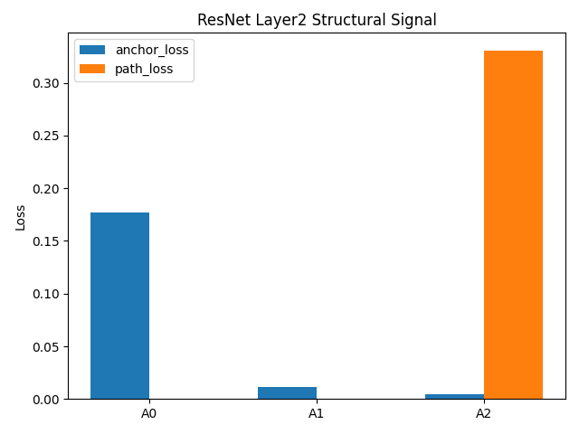
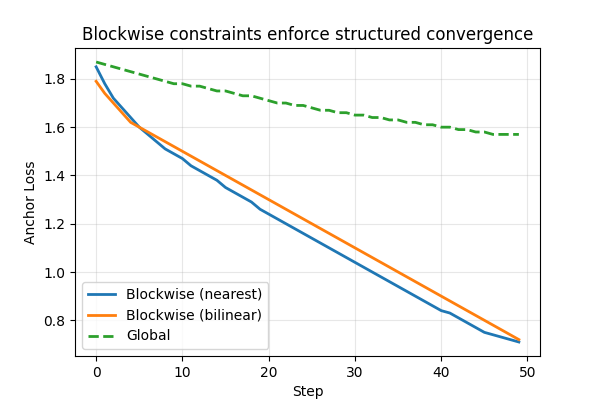

# Luoshu Kit V0.1 CNN -> ResNet

## LuoshuKit is a plug-in. Inject it into any model.

## A mechanistic interpretability layer — every value now has a computed address instead of being searched.

LuoshuKit implements a structured addressing layer for neural representations,
where internal values are assigned addresses that can be directly decoded rather than located through search.

---

## ResNet Structural Signal

Tested on ResNet (layer2) as a representative convolutional backbone, using a structured addressing mechanism derived from Luoshu-like principles.

For the full Luoshu addressing system (V0.2), see the Transformer-based implementation:
https://github.com/luolearning/luoshu-kit-transformers



ResNet layer2: A0 → A1 → A2

- A0: no structure  
- A1: anchor only  
- A2: path activated  

---

## Early Signal




---

## Usage

Install:

```bash
git clone https://github.com/luolearning/luoshu_kit.git
cd luoshu_kit
pip install -e .
```
## Minimal example (python)

```md

from luoshu_kit.luoshu_kit_a2_proto import inject
bridge = inject(model, layer_name="layer2")
